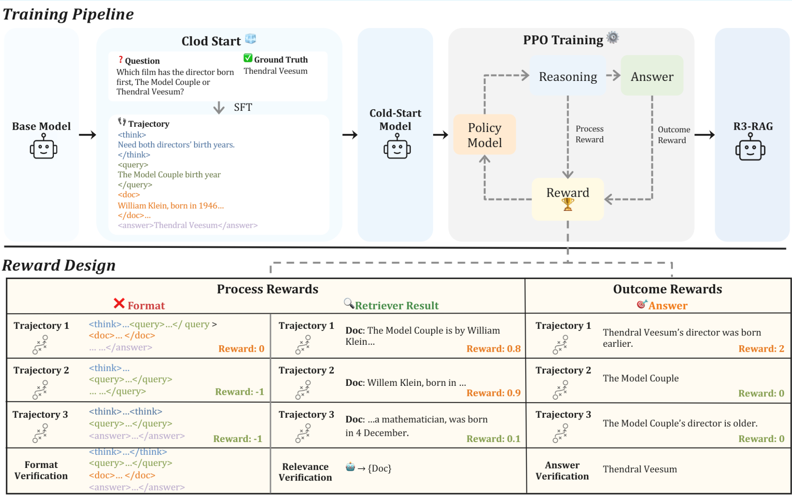

# R3-RAG: Learning Step-by-Step Reasoning and Retrieval for LLMs via Reinforcement Learning

[](https://arxiv.org/abs/2505.23794)
[](https://www.python.org/downloads/release/python-380/)
[](https://www.gnu.org/licenses/gpl-3.0)

## 📖 Overview

R3-RAG is a novel framework that uses **R**einforcement learning to teach LLMs how to **R**eason and **R**etrieve step by step. Unlike traditional RAG methods that rely on human-designed workflows, R3-RAG enables models to autonomously learn optimal reasoning-retrieval strategies through reinforcement learning with both outcome and process rewards.

<div align="center">

</div>

### Key Features
- 🔥 **Autonomous Learning**: Uses RL to learn reasoning-retrieval strategies instead of relying on fixed human-designed workflows
- 🎯 **Dual Reward System**: Combines outcome rewards (answer correctness) with process rewards (document relevance)
- 🚀 **Strong Performance**: Achieves significant improvements over state-of-the-art iterative RAG methods
- 🔄 **Transferable**: Works across different retrievers (E5, BGE, BM25) with consistent performance
- 📊 **Comprehensive**: Evaluated on multiple multi-hop QA datasets (HotpotQA, 2WikiMultiHopQA, MuSiQue)

## 📊 Main Results

Our method significantly outperforms existing baselines across three multi-hop QA datasets:

<div align="center">

| Methods | Retriever | HotpotQA | 2WikiMultiHopQA | MuSiQue | Average |
|---------|-----------|----------|-----------------|---------|---------|
| **Llama-3.1-8B** | | | | | |
| CoT | - | 39.2 | 28.8 | 14.0 | 27.3 |
| RAG with CoT | E5 | 53.3 | 32.9 | 16.3 | 34.2 |
| IRCoT | E5 | 52.8 | 40.6 | 16.7 | 36.7 |
| **R3-RAG** | **E5** | **64.4** | **61.0** | **32.2** | **52.6** |
| **R3-RAG** | **BGE** | **65.3** | **62.1** | **33.8** | **53.8** |
| **Qwen2.5-7B** | | | | | |
| CoT | - | 34.0 | 31.1 | 12.7 | 25.9 |
| RAG with CoT | E5 | 52.4 | 33.5 | 16.9 | 34.3 |
| IRCoT | E5 | 48.4 | 35.8 | 13.5 | 32.6 |
| **R3-RAG** | **E5** | **65.5** | **62.3** | **33.6** | **53.8** |
| **R3-RAG** | **BGE** | **66.4** | **63.0** | **34.8** | **54.8** |

</div>

## 🚀 Quick Start

### Environment Setup

We recommend setting up three separate conda environments to avoid dependency conflicts:

1. **FlashRAG Environment** (for retrieval tools): Please refer to [FlashRAG](https://github.com/RUC-NLPIR/FlashRAG) to set up the environment.

2. **LLaMA-Factory Environment** (for cold start training): Please refer to [LLaMA-Factory](https://github.com/hiyouga/LLaMA-Factory) to set up the environment.

3. **OpenRLHF Environment** (for RL training): Please refer to [OpenRLHF](https://github.com/OpenRLHF/OpenRLHF) to set up the environment, then install our modified openrlhf code in this repository.

### Model Download
Download our pre-trained models from Hugging Face:
```bash
# Cold start models
git clone https://huggingface.co/Yuan-Li-FNLP/R3-RAG-CS-Llama
git clone https://huggingface.co/Yuan-Li-FNLP/R3-RAG-CS-Qwen

# Full R3-RAG models
git clone https://huggingface.co/Yuan-Li-FNLP/R3-RAG-Llama
git clone https://huggingface.co/Yuan-Li-FNLP/R3-RAG-Qwen
```
## Quick Demo
Experience R3-RAG with our visualization interface:
```bash
# First, start the server
cd startup
bash server.sh

# Then, start the visualization interface
bash startup_visualize.sh
```
Make sure to configure the model paths and parameters in the startup scripts before running.

## 📁 Repository Structure
```bash
R3-RAG/
├── benchmark/ # Evaluation scripts and benchmarks
│ ├── evaluate.py # Main evaluation script
│ ├── metrics/ # Evaluation metrics implementation
│ └── datasets/ # Dataset loading and processing
├── data/ # Cold start data construction
│ ├── build_coldstart_data.py # Generate high-quality cold start trajectories
│ ├── data_processing/ # Data preprocessing utilities
│ └── templates/ # Prompt templates for data generation
├── startup/ # Demo and visualization scripts
│ ├── server.sh # Start the server
│ ├── startup_visualize.sh # Start visualization interface
│ └── demo_config.py # Configuration for demo
├── tool/ # Retrieval tools and services
│ ├── retrieval/ # Retrieval tool implementations
│ ├── vllm_service/ # VLLM service code
│ └── utils/ # Utility functions
├── train/ # Training frameworks
│ ├── llamafactory/ # SFT training with LLaMA-Factory
│ │ ├── sft_training.py # Cold start SFT training script
│ │ └── configs/ # Training configurations
│ └── openrlhf/ # RLHF training with OpenRLHF
│ ├── rl_training.py # Reinforcement learning training
│ ├── reward_models/ # Reward model implementations
│ └── configs/ # RL training configurations
├── README.md # This file
└── LICENSE # License file
```

## 🤗 Available Models and Data

### Models
- **[R3-RAG-CS-Llama](https://huggingface.co/Yuan-Li-FNLP/R3-RAG-CS-Llama)**: Cold start model based on Llama-3.1-8B
- **[R3-RAG-CS-Qwen](https://huggingface.co/Yuan-Li-FNLP/R3-RAG-CS-Qwen)**: Cold start model based on Qwen2.5-7B  
- **[R3-RAG-Llama](https://huggingface.co/Yuan-Li-FNLP/R3-RAG-Llama)**: Full R3-RAG model based on Llama-3.1-8B
- **[R3-RAG-Llama-ORM](https://huggingface.co/Yuan-Li-FNLP/R3-RAG-Llama-ORM)**: R3-RAG model with outcome reward only
- **[R3-RAG-Qwen](https://huggingface.co/Yuan-Li-FNLP/R3-RAG-Qwen)**: Full R3-RAG model based on Qwen2.5-7B

### Datasets
- **[R3-RAG-ColdStartTrainingData](https://huggingface.co/datasets/Yuan-Li-FNLP/R3-RAG-ColdStartTrainingData)**: High-quality cold start training trajectories
- **[R3-RAG-RLTrainingData](https://huggingface.co/datasets/Yuan-Li-FNLP/R3-RAG-RLTrainingData)**: Reinforcement learning training data

All models and datasets are available on [Hugging Face](https://huggingface.co/Yuan-Li-FNLP).

## 📄 Citation

If you find our work helpful, please consider citing:

```bibtex
@misc{li2025r3raglearningstepbystepreasoning,
      title={R3-RAG: Learning Step-by-Step Reasoning and Retrieval for LLMs via Reinforcement Learning}, 
      author={Yuan Li and Qi Luo and Xiaonan Li and Bufan Li and Qinyuan Cheng and Bo Wang and Yining Zheng and Yuxin Wang and Zhangyue Yin and Xipeng Qiu},
      year={2025},
      eprint={2505.23794},
      archivePrefix={arXiv},
      primaryClass={cs.CL},
      url={https://arxiv.org/abs/2505.23794}, 
}
```

## 🤝 Contributing

We welcome contributions! Please feel free to submit issues and pull requests.

## 📝 License

This project is licensed under the GNU General Public License v3.0 - see the [LICENSE](LICENSE) file for details.

## 🙏 Acknowledgments

- [FlashRAG](https://github.com/RUC-NLPIR/FlashRAG) for retrieval framework
- [LLaMA-Factory](https://github.com/hiyouga/LLaMA-Factory) for training framework  
- [OpenRLHF](https://github.com/OpenRLHF/OpenRLHF) for reinforcement learning framework

## 📞 Contact

For questions or collaborations, please contact:
- Yuan Li: liyuan24@m.fudan.edu.cn
- Xipeng Qiu: xpqiu@fudan.edu.cn

---
<div align="center">
Made with ❤️ by the Fudan NLP Group
</div>
